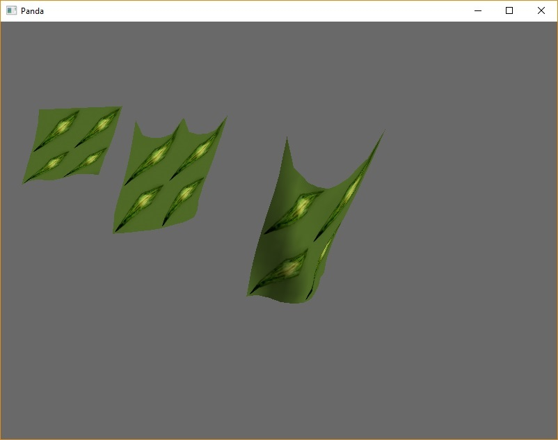

# rk4_cloth_sim
Simple Cloth Simulation using Runge-Kutta 4th order, without collision detection and using panda3d as render.


Usage:
```
from vec3 import Vec3
from cloth import Cloth
from cloth_geometry import ClothGeometry

#Cloth data
iSize = 10
jSize = 10
iDivisions = 11
jDivisions = 11
springK = 800
massPerM2 = 15
gravity = 10

cloth = Cloth(Vec3(0.0, 0.0, 0.0), iSize, jSize, iDivisions, jDivisions, springK, massPerM2, gravity)
cloth.lockJoint(0, 0)
cloth.lockJoint(iDivisions - 1, 0)
clothGeometry = ClothGeometry(cloth, 'Cloth')
```